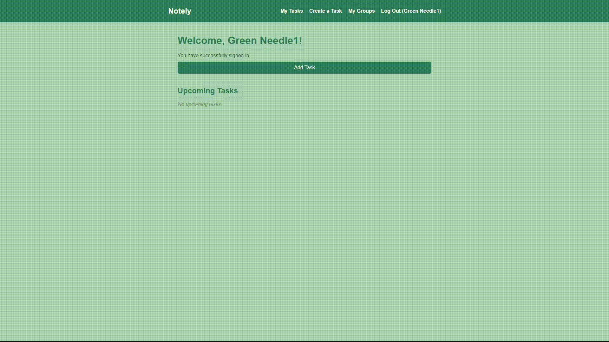
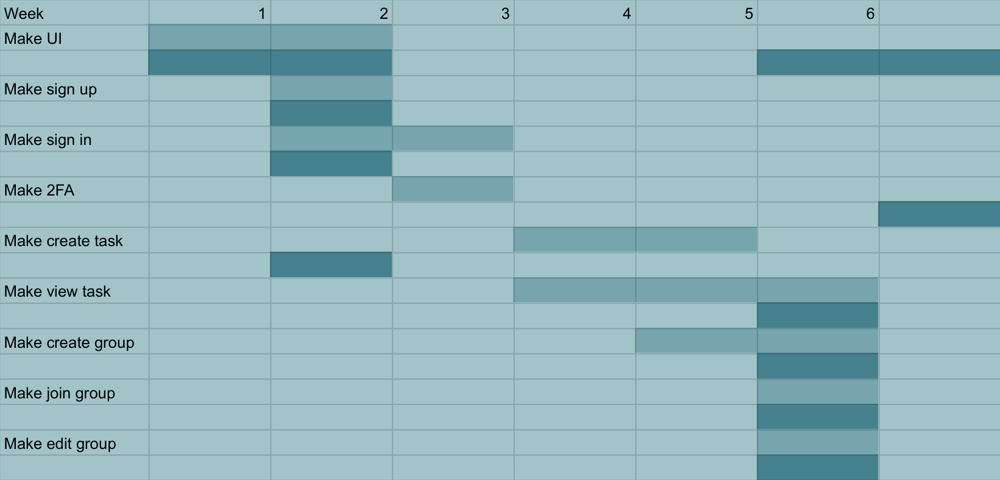

# Notely
> How to use Notely
  

## Sign Up
> Username, Email and password

## Sign In
> Username, Password + Email 2FA

  

# Groups
## Create Group
> Group Name, password

## Join Group
> Group Name, password

## Edit Group
> Delete group, leave group, view members, Kick members, change name or password

  

# Tasks

## Create Tasks
> Task name, due date, notes, private or post to group

## view Tasks
> View all above information as well as who it was posted by and what group they are from
> Able to filter by groups

# Website in Use

# Gant Chart

# Diary
## 13th of may
Made Basic sign in and sign out pages in the ui without any kind of verification or databases

## 22 may
Added databases for username password and mail, added minimum requirements for the password and stoops identical usernames

Made task form that allows submission with date, title and notes

## 18th jun
Fixed formatting

## 21 jun
Fixed formatting
made new group page that can:

Make new group 
	Group name
	Password
Join group 
	Group name
	Group password
Edit group 
	Pick a group to edit
	Change group Name
	Change group Password
	Show list of members
		Kick
Add Task
	Choose group to post or private
	
View tasks
	On each post show what group your in and who posted it

## 22nd June
Implemented 2FA

## 25th June
Salted and hashed log in passwords with bcrypt, added edit task and delete task (only if you created), added filter tasks by group or private, made password requirements update whilst making a password

